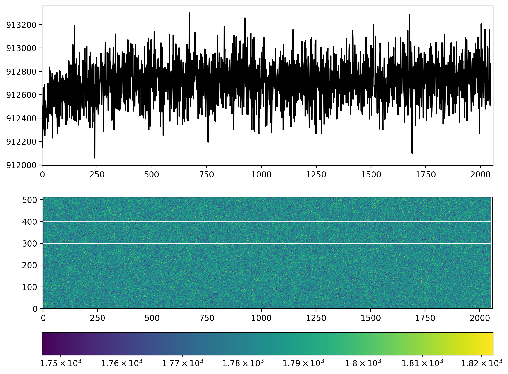

# About
Tools to control Jobin-Yvon 650mm spectrometer and Finger Lake Instruments camera.



## FLI camera backend (deprecated)

The FLI backend in `aklab_imaging` is **deprecated** and will be removed in a future release. It’s no longer maintained upstream and requires compiling C code plus the vendor SDK/drivers.

### Installing (optional extra)

If you still need it, install the optional extra:

```bash
# from PyPI (if/when published)
pip install "aklab-imaging[fli]"

# from a local clone of this repo
pip install -e ".[fli]"
```

This extra pulls in `pyfli` from Git and assumes you have the **FLI SDK/drivers** installed on your system.

`pyproject.toml` contains:

```toml
[project.optional-dependencies]
fli = ["pyfli @ git+https://github.com/charris/pyfli.git"]
```

### What you’ll see

Importing the FLI module will show a warning:

```
FutureWarning: FLI backend is deprecated and will be removed in a future release. This adapter is no longer maintained.
```

To silence it in your own scripts (not recommended unless you understand the impact):

```python
import warnings
warnings.filterwarnings("ignore", category=FutureWarning, module="aklab_imaging.cameras.fli")
```

### Notes

* You **must** install the FLI SDK/drivers separately; `pyfli` only provides Python bindings.
* If the SDK or `pyfli` is missing, importing/using the FLI backend will raise a clear runtime error.
* Prefer using and contributing to actively supported camera backends in this project.
